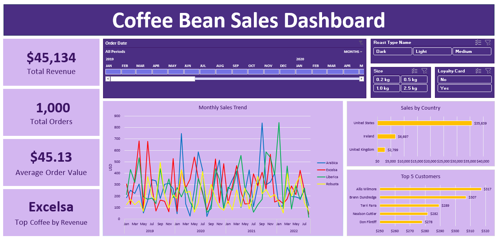

# Coffee Bean Sales Dashboard

## Project Overview

This project analyses transactional coffee sales data using Microsoft Excel to identify patterns in product performance, regional revenue, and customer behaviour. The analysis integrates multiple datasets before building an interactive dashboard to explore key sales insights.

## Project Objective

The objective of this project was to analyse transactional sales data and develop an interactive Excel dashboard that allows users to explore sales performance across products, regions, and time through dynamic filtering and visualisation.

## Data Source

The analysis uses the **Coffee Bean Sales Raw Dataset**, which contains **1,000+ coffee sales transactions**, including order, customer, and product information.

Source:
https://www.kaggle.com/datasets/saadharoon27/coffee-bean-sales-raw-dataset/data

The raw dataset used for this project is also included in the `data/` folder of this repository.

## Data Model

The analysis integrates three related datasets:

- **Orders** – transactional sales data containing order ID, order date, customer ID, product ID, and quantity ordered.
- **Customers** – customer information containing customer ID, customer name, email, phone number, address, city, country, postcode, and loyalty card status.
- **Products** – product details containing product ID, coffee type, roast type, size, unit price, price per 100g, and profit per unit sold.

The **Orders** table acts as the central fact table, linking customer and product information to each transaction through **Customer ID** and **Product ID**. These relationships allow sales performance to be analysed across products, regions, and customer segments.

## Analysis Workflow

### 1. Data Preparation

- Integrated customer and product information into the Orders table using Excel functions such as **XLOOKUP** and **INDEX-MATCH**.
- Created calculated fields such as **Sales (Quantity × Unit Price)** and additional categorical fields for coffee type and roast type.
- Standardised and cleaned data fields, including handling missing email values, formatting dates, and converting price fields to currency format.
- Improved data readability by expanding abbreviated product attributes (e.g., coffee type and roast type) into full categorical labels.
- Converted the dataset into an Excel table to enable dynamic updates in pivot tables and dashboard visualisations.

### 2. Data Analysis

- Used pivot tables to analyse sales performance across time, products, customers, and regions.
- Aggregated sales data by **month and year** to identify temporal sales trends.
- Analysed sales distribution across **coffee types** to compare product performance.
- Identified **top-performing countries** by total sales using ranked pivot table summaries.
- Applied a **Top 5 filter** to determine the highest-value customers based on total sales.

### 3. Dashboard Creation

- Built an interactive Excel dashboard using pivot charts to visualise key sales insights.
- Developed **KPI indicators** including total revenue, total orders, average order value, and top-selling products.
- Created a **time-series line chart** to track monthly sales trends across different coffee types.
- Added bar charts highlighting **top-performing countries** and **top 5 customers by sales**.
- Implemented **slicers and timeline filters** (coffee size, roast type, loyalty card status, and date) to enable dynamic data exploration.
- Linked all dashboard visualisations to shared filters to ensure synchronized and interactive analysis.

## Dashboard Preview



## Repository Structure

```
coffee-bean-sales-dashboard
│
├── data/
│   └── coffee-bean-sales-raw-data.xlsx
│
├── excel/
│   └── coffee-bean-sales-dashboard.xlsx
│
├── images/
│   └── coffee-bean-sales-dashboard-preview.png
│
├── LICENSE
└── README.md
```
